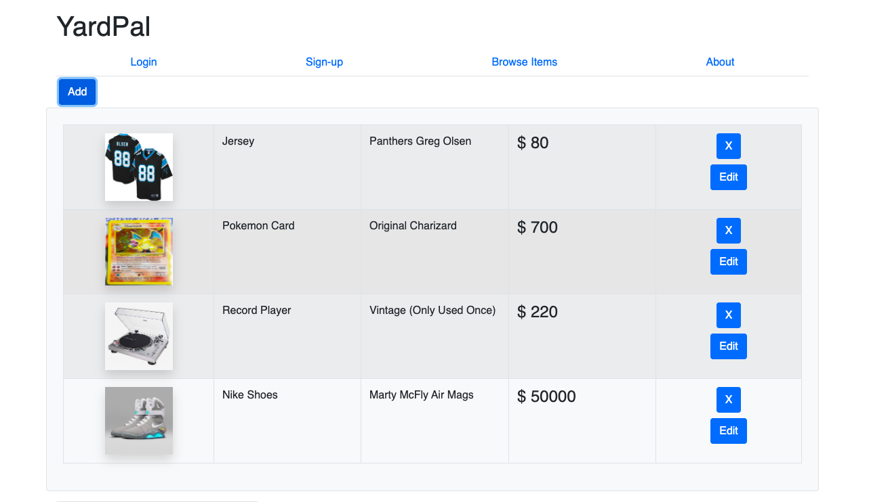

# [Yard Pal](https://yard-pal.herokuapp.com/)

- Yard Pal is an online web application that brings your local yard sales to your computer or device. With this application, you can view your local yard sales or host your own yard sale safely from your home. This way the sellers and buyers can safely communicate with each other and follow social-distancing guidelines. 

(https://yard-pal.herokuapp.com/)

## Table of Contents

- [Installation](#installation)
- [Usage](#usage)
- [Contributors](#contributing)
- [License](#license)

## Installation

- In order to access this application, all you need to do is click the hyperlink or picture of the application above and you will be directed to the website.

[back to Table of Contents](#table-of-contents)

## Usage

- For hosting your own yard sale, you will need to create an account on our sign-up page. After you have an account with Yard Pal, you will be able to post your items that are for sale and be able to edit them. Also you can contact potential customers that are intersted in any of the items that you have for sale.

- When you are looking to buy products at you local yard sale using this application, all you need is the username (email) of the host of the yard sale. You don't need to make an account, you can search the sellers username (email) on the browse items page and you will get to look at their inventory. From there you can request the item(s) that you are interested in and send your contact information along with a message to the seller. Then, the seller will contact you to continue with the transaction.

[back to Table of Contents](#table-of-contents)

## Contributors

- [Everett](https://github.com/diuguide/)
- [Ibrahim](https://github.com/iariyami)
- [Suresh](https://github.com/s-suresh-kumar)
- [Thad](https://github.com/thadkingcole)

[back to Table of Contents](#table-of-contents)

## License

[MIT](LICENSE) copyright (c) 2020 Everett, Ibrahim, Suresh, Thad.

[back to Table of Contents](#table-of-contents)
